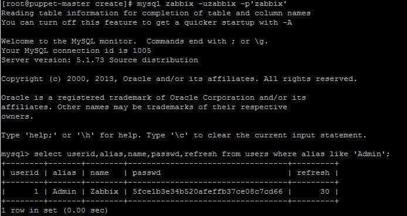
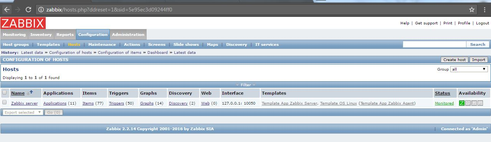
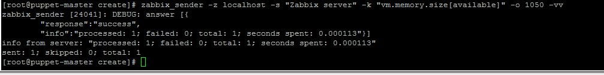

# zabbix task3
***Student***: [Aliaksei Khurhin](https://epa.ms/1Cqi0K)

1. Screenshot with UserParameter in agent config

2. Screenshot with user parameter corresponding item in host config:

3. Screenshot with “Latest data” tab with data for item for that external [script](script.sh):

4. Screenshot with “Latest data” tab in “History” view for collected data with log monitoring:

5. Screenshot with graphics with speed and response time for website:

6. Screenshot with “Latest data” tab with collected data:

7. Screenshot with graphics:

8. Screenshot with screen:

