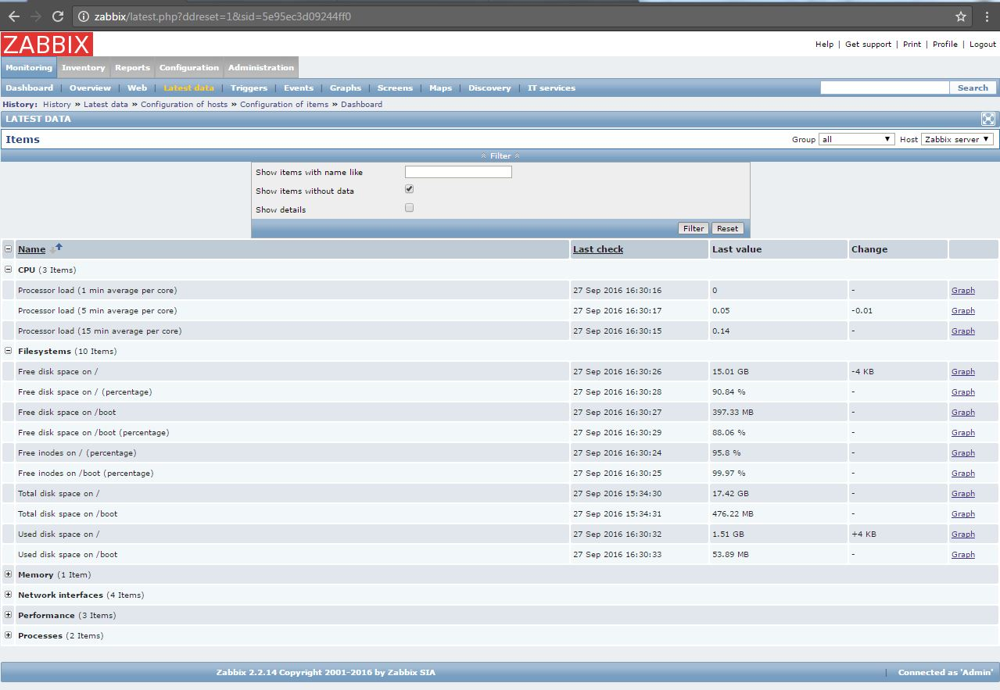
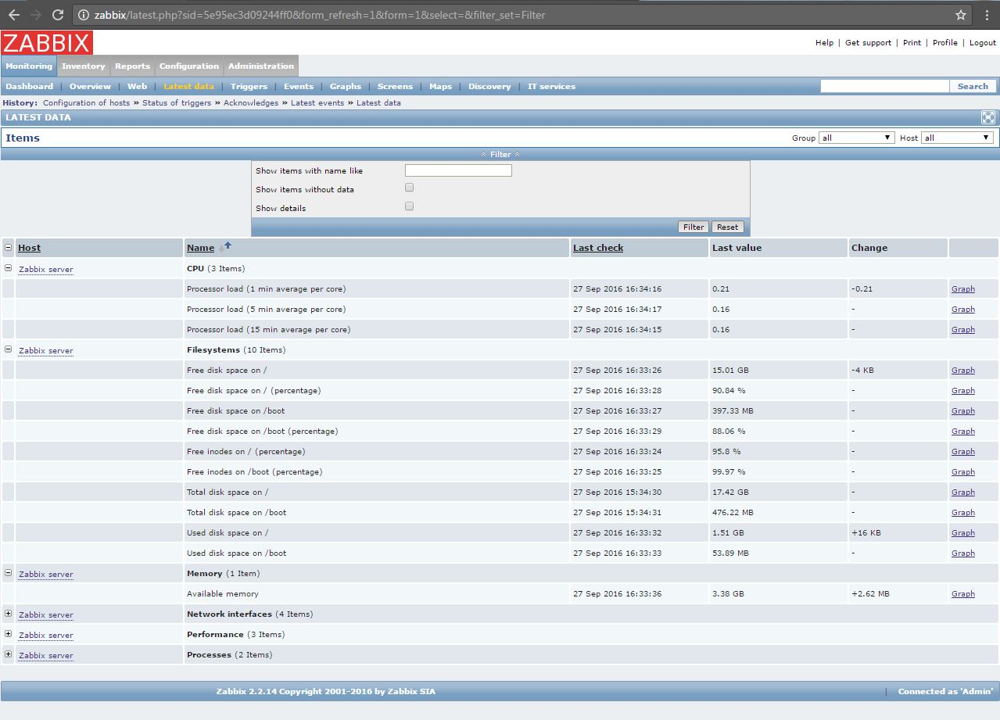

# zabbix lab1

***Student***: [Aliaksei Khurhin](https://epa.ms/1Cqi0K)

1.	Screenshot with result of execution SQL statement:

2.	Screenshot with tab “Monitoring->Latest data”:

3.	Screenshot with tab “Configuration->Hosts” (group:all):

4.	Screenshot with triggers list, tab “Latest data” with collected data:

5.	Screenshot with tab “Latest data” with collected data:

6.	Screenshot with active items:

7.	Screenshot with “Monitoring->Triggers” with trigger history:

8.	Screenshot with process of using zabbix_sender and with server reply:

9.	Screenshot with process of using zabbix_get and with agent reply:

Virtual machine starts with vagrant provision (2 sections), [Vagrantfile](Vagrantfile) included.
