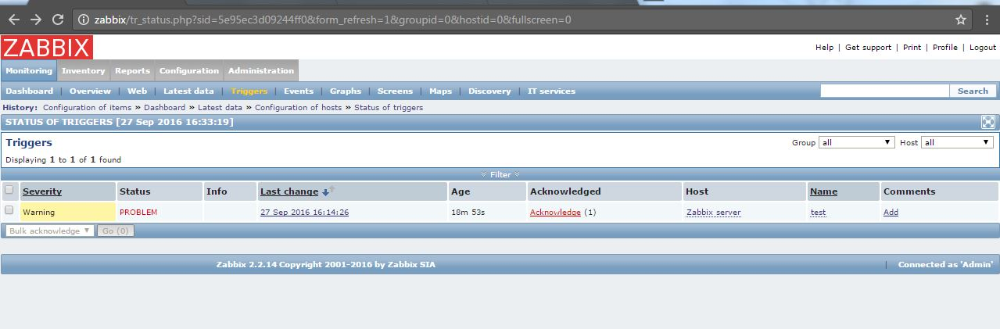

# zabbix task2
***Student***: [Aliaksei Khurhin](https://epa.ms/1Cqi0K)

1.	Screenshot of item and trigger configuration:

2. Screenshot of log data:

3. Screenshot of latest data with log:

4. Screenshot with trigger alert:

5. [Script](test.sh) is provided, ip and token are obtaining automatically.
Some details about json files: [first](1.json) one is for receiving authentication token, [second](2.json) is just for testing, [third](3.json) is used in script.
6. Screenshot of request output:

7. Screenshot of registered host configuration:

